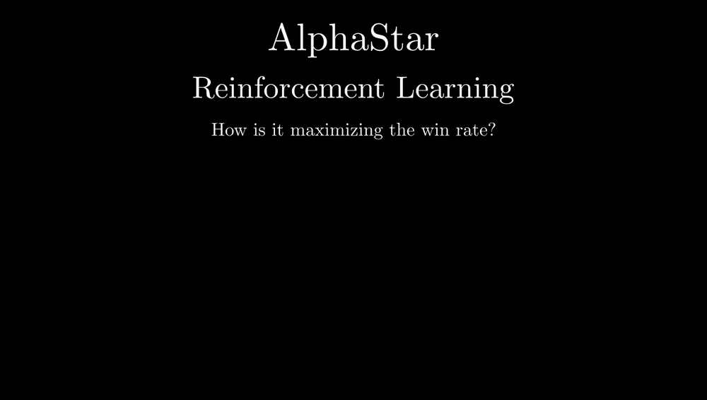

# AlphaStar Manim

This is a manim presentation I made to explain AlphaStar (DeepMind's StarCraft II agent) and how it's trained.

The slides are built in Python with [Manim](https://www.manim.community/) and [Manim Slides](https://manim-slides.eu/).



## What's in here

- `title.py`: front slide
- `starcraft.py`: intro to the Star Craft game and why it's a hard RL problem
- `alphastar.py`: AlphaStar's policy, observations and actions
- `training.py`: how the agent is trained (supervised learning + RL)
- `bibliography.py`: references
- `assets/`: images used in the slides

## How to run it

You need [uv](https://docs.astral.sh/uv/) and a working LaTeX install (Manim uses it to render the math).

1. Install the dependencies:

   ```bash
   uv sync
   ```

2. Render a slide file, e.g. the StarCraft intro:

   ```bash
   uv run manim-slides render starcraft.py Starcraft
   ```

   Swap `starcraft.py Starcraft` for any of the other files/classes above (`alphastar.py AlphaStar`, `training.py Training`, `title.py Title`, `bibliography.py Bibliography`).

3. Play the result in a presentation window:

   ```bash
   uv run manim-slides present Training
   ```

That's it — click through with arrow keys / spacebar once the presentation window opens.
